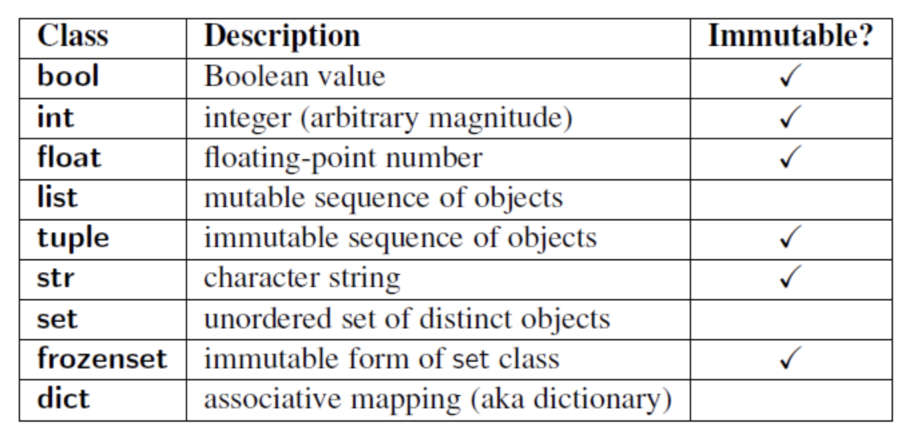

# Заметки по `python`

## Лицензия

Распространяется под [**MIT License**](https://github.com/Senyos/python-notes/blob/master/LICENSE) *(c) 2025 DjBlooky*.

Свободное распространение, использование и т. д.

# Важные ссылки

- [Docs Python3 Built-in Types](https://docs.python.org/3/library/stdtypes.html)

# Содержание

---

- [Типы данных](#типы-данных)
    - [Типы данных по возможности изменения (mutable)](#типы-данных-по-возможности-изменения-mutable)
    - [Информация о типах данных (классах)](#информация-о-типах-данных-классах)
    - [`int` целое число](#int-целое-число)
    - [`bool` логический](#bool-логический)
    - [`float` число с плавающей точкой](#float-число-с-плавающей-точкой)
    - [`str` строка](#str-строка)
    - [`list` список](#list-список)
    - [`tuple` кортеж](#tuple-кортеж)
    - [`set` массив](#set-массив)
    - [`frozenset` замороженный массив](#frozenset-замороженный-массив)
    - [`dict` словарь](#dict-словарь)

- [Базовые функции](#базовые-функции)

---

# Типы данных (классы)

Все типы данных `python` это инстансы (объекты) классов. Проверить тип данных переменной можно с помощью `type(<ПЕРЕМЕННАЯ>)`.

Сравнить тип данных переменной можно с помощью `isinstance(<ПЕРЕМЕННАЯ_1>,<ПЕРЕМЕННАЯ_2>)` или `isinstance(<ПЕРЕМЕННАЯ_1>,<class>)`, где вместо `<class>` может быть `int` или `str` и так далее.

## Типы данных по возможности изменения (mutable)

### Изменяемые

- `list` список
- `set` массив
- `dict` словарь

### Неизменяемые

- `bool` логический
- `int` целое число
- `float` число с плавающей точкой
- `str` строка
- `tuple` кортеж
- `frozenset` массив

<center>Классы типов данных по возможности изменения (immutable - неизменяемый):</center>



<center>Общая схема типов данных и их работы:</center>


## Числовые типы данных (Numeric Types)

- `int` целое число
- `float` число с плавающей точкой
- `complex` комплексные числа

## Информация о типах данных (классах)

### `int` целое число

Функция `int()` возвращает целое число в **десятичной системе счисления**. Если не удаётся преобразовать **первый** или **единственный** аргумент в десятичное число, то генирируется **исключение** `exception` `ValueError`.

Если вызвать функцию `int()` без аргументов, она вернет `0`.

```py
>>> int()
0
```


### `bool` логический

Логический (булевый) тип данных. Принимает на вход два значения: `True` или `False` (обязательно с большой буквы).

Класс `bool` наследуется от `int` (является подклассом), поэтому `True` и `False` в `python` ведут себя как числа `1` и `0`. Отличие только в том, как они выводятся на экран.

Функция `bool()` вернет `True`:

- непустая строка `str` (в том числе если это один или несколько пробелов)
- ненулевое число `int` или `float` (в том числе меньшее единицы, например -5)
- непустой список `list` или кортеж `tuple` (даже если он содержит один пустой элемент, например пустой кортеж)
- функция

Функция `bool()` вернет `False`:

- пустая строка `str`
- нулевое число `int` или `float`
- пустой список `list` или кортеж `tuple`

### `float` число с плавающей точкой

### `str` строка

### `list` список

### `tuple` кортеж

### `set` массив

### `frozenset` замороженный массив

### `dict` словарь

# Базовые функции

# Вы можете помочь заметкам (как?)

Предлагайте свои добавления, изменения. Как сделать красивее и точнее, понятнее. Можно контрибьютить в этот `github` репозиторий. Создавать `issue`. Клонировать `git clone https://github.com/Senyos/python-notes.git` чтобы скопировать себе репозиторий.